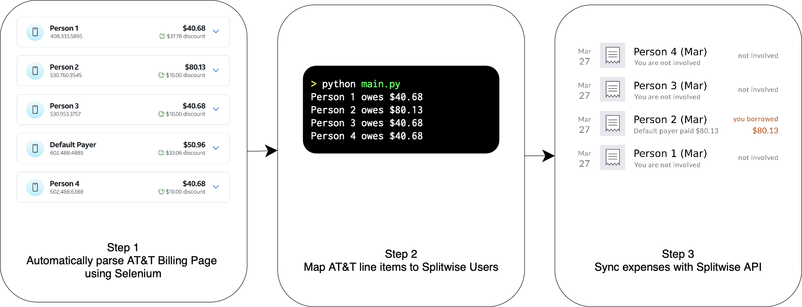

# AT&T Splitwise Sync

Automates the process of parsing an AT&T bill and generating Splitwise expenses for each user.

## Pre-requisites
1. Install the dependencies using `pip install -r requirements.txt`
2. Create a new Splitwise group and add all the users to it.
3. Run the program using `python main.py`. The program will walk you through the configuration steps.